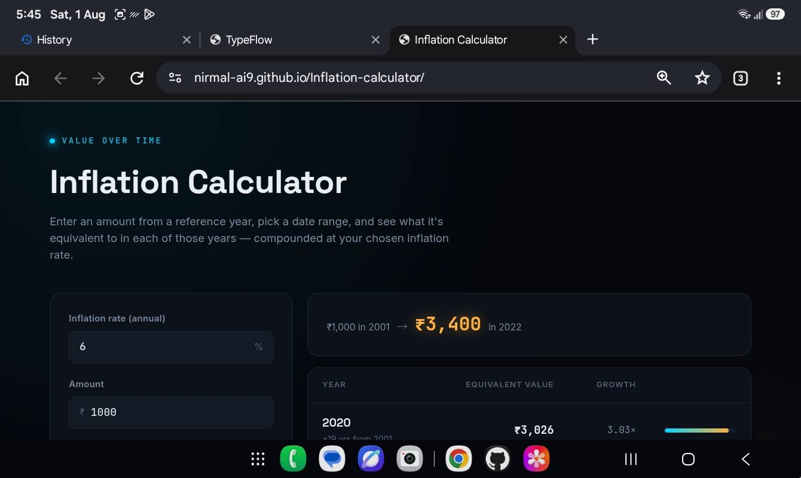

# Inflation Calculator

Inflation Calculator is a web application that shows how the value of money changes over time because of inflation. By entering an amount, an annual inflation rate, and a range of years, you can instantly compare the purchasing power of money across different points in time.

The project was created to make inflation easier to understand through interactive calculations and a clean, modern interface. Instead of focusing on financial jargon, it presents the numbers in a simple way that's useful for learning, planning, or satisfying curiosity.

## Screenshot:


## Join Our Discord Community

Have questions, ideas, or feedback? Join the Discord server to discuss projects, suggest features, report bugs, and connect with other developers.

🔗 Discord: https://discord.gg/dKa2wEJGF9

Everyone is welcome. See you there!

## Features

- Calculate the future value of money using compound inflation.
- Compare the equivalent value across multiple years.
- View growth as both monetary value and multiplier.
- Modern, responsive interface with instant calculations.
- No installation or internet connection required after downloading.

## Running the Project

Clone the repository and open `index.html` in your browser.

```bash
git clone https://github.com/nirmal-ai9/Inflation-calculator.git
cd Inflation-calculator
```

That's it—no dependencies, build tools, or setup required.

## Why I Built This

I wanted a calculator that explains inflation visually instead of just displaying a single number. This project was also an opportunity to explore interface design, animations, and mathematical calculations while keeping everything lightweight and easy to use.

## Contributing

Found a bug or have an idea for improvement? Feel free to open an issue or submit a pull request.

## License

This project is licensed under the MIT License. See the `LICENSE` file for more information.

## Author: Nirmal

<div align="center">

<a href="https://nirmal-ai9.github.io/portfolio/">
  
</a>

</div>
